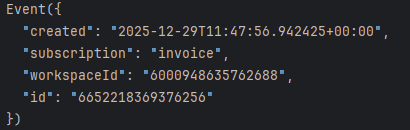
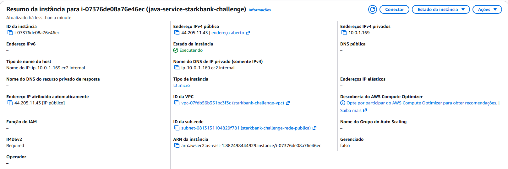
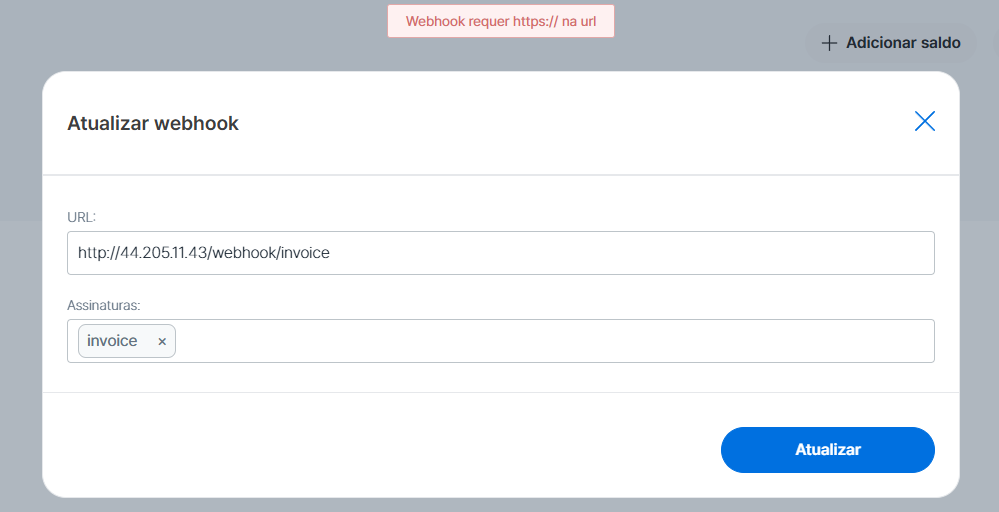

# ms-stark-bank

Microservice responsible for integrating with the **Stark Bank API**, centralizing **Invoice** creation, **Transfer** execution, and receiving **Webhook events**.

The goal of this project is to abstract communication with Stark Bank and provide a secure and well-organized service layer for financial operations.

---

## 📌 Architecture Overview

- **InvoiceService**  
  Responsible for creating and formatting invoices.

- **TransferService**  
  Responsible for creating and formatting bank transfers.

- **Webhook**  
  Endpoint exposed to receive asynchronous events sent by Stark Bank (e.g. paid invoices).

---

## 🔔 Webhook

The project exposes a webhook endpoint to receive real-time notifications from Stark Bank whenever a state change occurs in an **Invoice**.

### Expected behavior

- Receives events via `POST` requests
- Immediately returns **HTTP 200** to acknowledge receipt
- Event processing can be handled asynchronously
- Must handle **duplicate** and **out-of-order** events

### Examples of received events

- `invoice.created`
- `invoice.paid`

The webhook is essential to keep the system’s internal state synchronized with Stark Bank.

---

## 🧾 InvoiceService

The **InvoiceService** is responsible for all operations related to invoices.

### Responsibilities

- Create invoices in Stark Bank
- Format invoices

### Basic flow

1. The system requests the creation of an invoice  
2. The `InvoiceService` sends the request to Stark Bank  
3. Stark Bank processes the invoice  
4. Update events are later sent via webhook  
5. The transfer is created and sent to another account  

---

## 💸 TransferService

The **TransferService** encapsulates financial transfer operations.

### Responsibilities

- Create transfers (PIX / TED)
- Format transfers

---

## 🔄 Integration Between Services and Webhook

- **InvoiceService** and **TransferService** initiate operations in Stark Bank
- The **Webhook** receives asynchronous confirmation or failure events
- The system uses these events to:
  - Continue the flow by executing the transfer

---

## 🛠️ Technologies Used

- Java
- Spring Boot
- Stark Bank API
- Webhooks for asynchronous communication

---

## 🚀 Running the Project

1. Configure Stark Bank credentials via environment variables in a `.env` file  
2. Build the project  
3. Run the application  
4. Expose the webhook endpoint publicly (e.g. via ngrok or a cloud server)

---

## ⚠️ Important Notes

- The webhook **must respond quickly with HTTP 200**
- Events may be resent by Stark Bank

### Error found
- During testing of the SDK event parser, it was observed that the returned object did not contain the log property, causing the processing flow to be incomplete.
- As a workaround, a custom DTO was implemented to correctly deserialize the event and extract the required data.

### Parser returned value

---

## 📄 License

Educational and experimental project.

## Deployment Note

The application has been deployed on an EC2 instance. However, since a custom domain has not been configured, it was not possible to generate an SSL certificate. As a result, HTTPS requests could not be made.

This limitation affected the Stark Bank integration, as their API does not allow HTTP endpoints for webhooks or callbacks, requiring a secure HTTPS connection.

